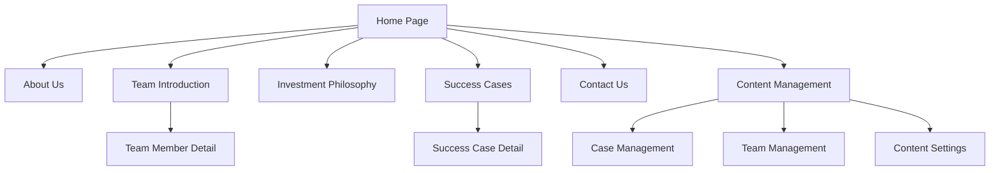
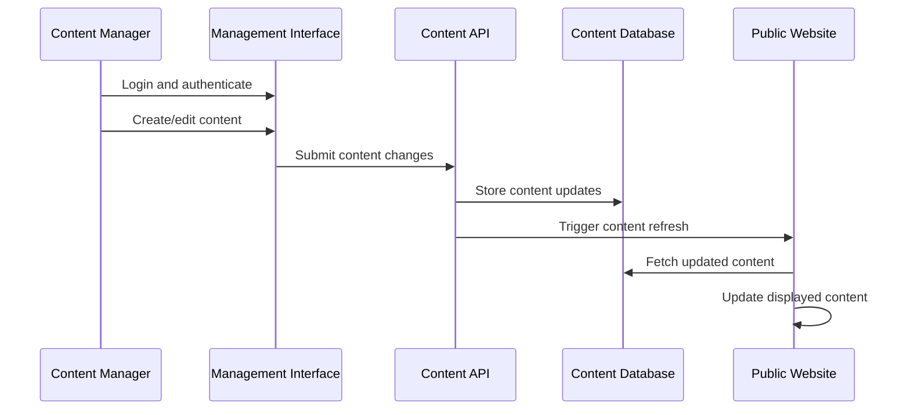

# AIHC Capital Official Website Restructure Design

## Overview

The AIHC Capital official website restructure project aims to create a professional, modern, and user-friendly corporate website that effectively showcases the company's investment philosophy, team expertise, and successful portfolio cases. This redesign addresses the current website's limitations in content management and visual appeal while establishing a robust foundation for future growth.

### Project Scope
- Complete website restructure using modern web technologies
- Implementation of content management system for dynamic content updates
- Responsive design supporting multiple devices and browsers
- Server-side rendering optimization for SEO and performance
- Enhanced user experience with intuitive navigation and professional aesthetics

### Business Objectives
- Present AIHC Capital as a professional and trustworthy investment firm
- Provide easy access to company information, team profiles, and investment philosophy
- Showcase successful investment cases to build credibility
- Enable self-service content management to reduce maintenance overhead
- Improve search engine visibility and page load performance

## Technology Stack & Dependencies

### Core Framework
- **Vue 3**: Progressive JavaScript framework for building user interfaces
- **Vite**: Fast build tool and development server
- **TypeScript**: Type-safe JavaScript development
- **Server-Side Rendering (SSR)**: For improved SEO and initial page load performance

### Styling & UI
- **Tailwind CSS**: Utility-first CSS framework for rapid UI development
- **Responsive Design**: Mobile-first approach supporting all screen sizes
- **Custom Components**: Reusable UI components following design system principles

### Content Management
- **Dynamic Content System**: For managing cases, team members, and other dynamic content
- **Admin Interface**: Secure content management dashboard
- **Real-time Updates**: Immediate content reflection without deployment

## Component Architecture

### Layout Components

#### Primary Layout Template
The website employs a consistent three-section layout structure across all pages:

**Header Section (Top Area)**
- Left: AIHC Capital logo with brand identity
- Right: Horizontal navigation menu with primary navigation items
- Navigation items: About Us, Team Introduction, Investment Philosophy, Success Cases, Contact Us
- Responsive design: Hamburger menu for mobile devices

**Main Display Area**
- Dynamic content area that adapts to different page requirements
- Consistent spacing and typography across all page types
- Responsive grid system for optimal content presentation

**Footer Section**
- Copyright information and legal notices
- Privacy policy and terms of service links
- Contact information and company address
- Social media links and additional company resources

### Page Components

#### Homepage Component
- Hero section with company tagline and call-to-action
- Company overview with compelling value proposition
- Featured success cases or key achievements
- Quick access to primary navigation sections

#### Team Introduction Component
- Team overview section with rich media content
- Member grid layout (4 members per row on desktop)
- Individual member cards displaying:
  - Professional headshot photograph
  - Full name and job title
  - Brief professional summary
  - Interactive click-through to detailed profile

#### Team Member Detail Component
- Comprehensive professional profile display
- Personal background and career history
- Industry expertise and specialization areas
- Professional achievements and credentials
- Previous experience and educational background

#### Investment Philosophy Component
- Strategic investment approach documentation
- Market insights and industry perspectives
- Investment criteria and decision-making framework
- Case studies demonstrating philosophy application

#### Success Cases Component
- Portfolio showcase with grid layout (4 cases per row)
- Case summary cards containing:
  - Company/project name and brief description
  - Investment overview and key metrics
  - External website link for additional information
  - Click-through navigation to detailed case study

#### Success Case Detail Component
- Comprehensive case study presentation
- Investment timeline and milestones
- Financial performance and strategic outcomes
- External links to portfolio company websites
- Lessons learned and strategic insights

#### Contact Us Component
- Complete company contact information
- Physical address with integrated map functionality
- Multiple contact methods (phone, email, address)
- Interactive features:
  - Email links triggering mail client
  - Phone number click-to-call on mobile devices
  - Map integration for navigation assistance

### Content Management Components

#### Admin Dashboard
- Secure authentication and role-based access control
- Content management interface for dynamic content
- Real-time preview capabilities
- Content approval workflow

#### Case Management Interface
- CRUD operations (Create, Read, Update, Delete) for success cases
- Rich text editor for case descriptions
- Image upload and management system
- URL validation and link management
- Immediate content publication workflow

## Routing & Navigation

### Navigation Architecture

### Route Structure

| Route Path | Component | Access Level | Description |
|------------|-----------|--------------|-------------|
| `/` | Homepage | Public | Main landing page with company overview |
| `/about` | About Us | Public | Company background and mission |
| `/team` | Team Introduction | Public | Team overview and member grid |
| `/team/:id` | Team Member Detail | Public | Individual team member profiles |
| `/philosophy` | Investment Philosophy | Public | Investment approach and insights |
| `/cases` | Success Cases | Public | Portfolio showcase grid |
| `/cases/:id` | Success Case Detail | Public | Detailed case studies |
| `/contact` | Contact Us | Public | Company contact information |
| `/admin` | Content Management | Authenticated | Admin dashboard |
| `/admin/cases` | Case Management | Authenticated | Success case CRUD interface |

### Navigation Behavior
- Smooth page transitions with loading states
- Breadcrumb navigation for deep pages
- Active state indication for current page
- Mobile-responsive navigation with collapsible menu
- Search functionality within content management areas

## Styling Strategy

### Design System Foundation

#### Color Palette
- Primary brand colors aligned with AIHC Capital identity
- Professional color scheme emphasizing trust and sophistication
- Accessible color contrast ratios meeting WCAG guidelines
- Dark and light theme variants for different content sections

#### Typography Scale
- Professional font family selection for corporate communication
- Hierarchical text sizing for content organization
- Consistent line spacing and letter spacing
- Optimized readability across all device sizes

#### Spacing System
- Consistent margin and padding scale throughout the application
- Grid-based layout system for content alignment
- Responsive spacing adjustments for different screen sizes
- Component-specific spacing rules for optimal visual hierarchy

### Responsive Design Strategy

#### Breakpoint System
- Mobile First: 320px - 767px (single column layout)
- Tablet: 768px - 1023px (two-column layout)
- Desktop: 1024px+ (multi-column grid layout)
- Large Desktop: 1440px+ (wide-screen optimization)

#### Component Responsiveness
- Team member grid: 1 column (mobile), 2 columns (tablet), 4 columns (desktop)
- Success cases grid: 1 column (mobile), 2 columns (tablet), 4 columns (desktop)
- Navigation: Hamburger menu (mobile), horizontal menu (desktop)
- Content layout: Stack vertically (mobile), side-by-side (desktop)

### Tailwind CSS Implementation
- Utility-first approach for rapid development
- Custom component classes for repeated patterns
- Responsive variants for all interactive elements
- Custom configuration for brand-specific design tokens

## State Management

### Content State Management

#### Static Content State
- Page content that rarely changes (company information, philosophy)
- Cached at build time for optimal performance
- Version control integration for content updates

#### Dynamic Content State
- Success cases and team member information
- Real-time updates through content management system
- Client-side caching with refresh mechanisms

#### User Interface State
- Navigation state (current page, menu visibility)
- Loading states for content transitions
- Form states for content management interfaces
- Error handling and user feedback states

### Content Management State Flow

## API Integration Layer

### Content Management API

#### Authentication Endpoints
- User authentication and session management
- Role-based access control for content management
- Secure token-based authentication system

#### Content CRUD Operations

| Endpoint | Method | Purpose | Request Format |
|----------|--------|---------|----------------|
| `/api/cases` | GET | Retrieve all success cases | Query parameters for filtering |
| `/api/cases` | POST | Create new success case | JSON case object |
| `/api/cases/:id` | PUT | Update existing case | JSON case object |
| `/api/cases/:id` | DELETE | Remove success case | Case ID parameter |
| `/api/team` | GET | Retrieve team members | Query parameters for filtering |
| `/api/team/:id` | GET | Get member details | Member ID parameter |

#### Response Format Standards
- Consistent JSON response structure
- Error handling with descriptive messages
- Pagination support for large content collections
- Content validation and sanitization

### External Integrations

#### Map Services Integration
- Amap (Gaode Maps) integration for location display
- Interactive map functionality for contact page
- Mobile-optimized map navigation features

#### Social Media Integration
- Links to company social media profiles
- Social sharing functionality for success cases
- Professional network integration capabilities

## Testing Strategy

### Unit Testing Approach
- Component-level testing for all reusable components
- State management testing for content operations
- Utility function testing for data processing
- Mock data scenarios for content management operations

### Integration Testing
- End-to-end user journey testing
- Content management workflow testing
- Cross-browser compatibility testing
- Mobile device testing across different screen sizes

### Performance Testing
- Page load speed optimization
- Server-side rendering performance
- Content management system responsiveness
- Database query optimization

### Accessibility Testing
- Screen reader compatibility
- Keyboard navigation support
- Color contrast validation
- Mobile accessibility features

## Content Management Architecture

### Administrative Access Control

#### User Roles and Permissions
- **Super Admin**: Full system access and user management
- **Content Manager**: Success case and team content management
- **Editor**: Content editing with approval workflow
- **Viewer**: Read-only access to management interface

#### Security Implementation
- Multi-factor authentication for administrative access
- Session timeout and automatic logout mechanisms
- Audit logging for all content management activities
- IP-based access restrictions for enhanced security

### Content Workflow Management

#### Success Case Management Process
1. **Creation Phase**: Content manager creates new case entry
2. **Content Entry**: Rich text editor for detailed case information
3. **Media Upload**: Image and document attachment capabilities
4. **Preview Phase**: Real-time preview before publication
5. **Publication**: Immediate live website content update
6. **Monitoring**: Analytics and engagement tracking

#### Team Member Management Process
1. **Profile Creation**: Basic information and contact details
2. **Professional Details**: Experience, expertise, and achievements
3. **Media Management**: Professional photos and documents
4. **Content Review**: Quality assurance and accuracy verification
5. **Publication**: Live website profile activation

### Data Management Strategy

#### Content Storage Architecture
- Structured data models for consistent content organization
- Version control for content changes and rollback capabilities
- Backup and recovery procedures for content protection
- Performance optimization through content caching strategies

#### Content Validation Rules
- Required field validation for essential information
- URL format validation for external links
- Image format and size optimization requirements
- Content length guidelines for optimal display

## Performance Optimization

### Server-Side Rendering Implementation
- Initial page load optimization through pre-rendered content
- Search engine optimization through server-generated HTML
- Progressive enhancement for interactive features
- Cached content delivery for frequently accessed pages

### Content Delivery Optimization
- Image optimization and responsive image serving
- Lazy loading for non-critical content sections
- Content compression and minification
- Browser caching strategies for static assets

### Database Performance
- Optimized queries for content retrieval
- Indexing strategies for search functionality
- Connection pooling for concurrent user management
- Regular performance monitoring and optimization

This design document provides the strategic foundation for developing a modern, professional website that meets AIHC Capital's business objectives while providing an excellent user experience and efficient content management capabilities.